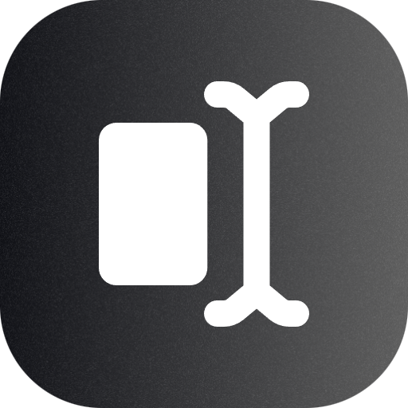

<p align="center">
  
</p>

<h1 align="center">URLPad</h1>

<p align="center">
  A minimalist text editor where the entire document lives inside the URL.
</p>

<p align="center">
  <a href="https://github.com/Solez-ai/url-pad">Source Code</a>
</p>

<p align="center">
  
  
  
  
</p>

---

## What is URLPad?

**URLPad** is a zero-backend, privacy-first text editor where the **entire document is stored inside the URL**.

There are no accounts, no databases, and no servers.  
If you can copy a link, you can share a document.

The URL itself is the source of truth.

---

## Why URLPad?

- No sign-ups
- No cloud storage
- No tracking
- No backend infrastructure
- Fully client-side

URLPad is intentionally minimal.  
Less UI. Less friction. More focus.

---

## How It Works

1. Text is written in a contenteditable editor
2. The content is compressed using Deflate
3. The compressed data is encoded using Base64 (URL-safe)
4. The result is stored in the URL hash (`#`)
5. Opening the same URL restores the exact document

The URL hash never reaches the server.

---

## Features

### URL-Based Storage
- Entire document stored in the URL hash
- Deflate compression + Base64 URL-safe encoding
- URL is the single source of truth
- Fully shareable by copying the link

---

### Markdown Highlighting
Markdown is styled inline while editing (syntax highlighting only).

Supported patterns:
- `# Heading`, `##`, `###` …
- Inline code using backticks
- Fenced code blocks
- Bold, italic, strikethrough
- Clickable URLs

There is no preview pane by design.

---

### CSS Styling via DevTools
The editor can be styled by modifying the `<article>` element directly in DevTools.

Examples:
- Font family
- Font size
- Line height
- Text color

The applied styles are captured, compressed, and stored inside the URL alongside the content.

---

### Auto Title from Markdown
If the document starts with a top-level heading:

```md
# My Title
```

The browser tab title automatically updates to match.

---

### LocalStorage Backup
- URL hash is always primary
- LocalStorage is used only as a fallback
- If the page loads without a hash, the last session is restored

---

### Custom Undo / Redo
- Custom editor history implementation
- Supports typing, paste, cut, undo, and redo
- Cursor position is preserved even with syntax highlighting

---

### Download as HTML
- Press **Ctrl + S**
- Saves a standalone .html file
- Removes editor UI and scripts
- Leaves clean, readable content

---

### QR Code Sharing
- `/qr` route generates a QR code for the current document
- Useful for sharing between devices

---

### Minimal Menu
A three-dot menu provides:
- New Document (`/#new`)
- GitHub repository
- QR code generation

---

## Deployment
- Hosted on Vercel or any static host
- Fully static
- Works offline after first load
- No server-side logic

---

## Tech Stack

- HTML
- CSS
- Vanilla JavaScript
- Browser Compression API
- URL Hash
- LocalStorage (fallback only)

No frameworks. No backend.

---

## Philosophy

URLPad is not a document platform.  
It is a tool.

The constraint is the feature.

---

## Author

Created by **Samin Yeasar** ([Solez-ai](https://github.com/Solez-ai))

---

## License

MIT License
